<p align="center">
  
</p>

<h1 align="center">loop-kernel</h1>

<p align="center">
  <b>Tell your agent <i>“set up a loop.”</i> It interviews you, then writes a self-driving loop that provably halts.</b><br>
  Agent-native: Claude Code and Codex read <code>AGENTS.md</code>, run the six-question interview
  <i>in your conversation</i>, and call the scribe (<code>init.sh</code>) for you — out comes a
  paste-ready <code>/goal</code> with nested loops, an unfakeable check, three hard stops, durable memory.<br>
  Prefer a terminal? <code>./loop init</code> asks the same six questions itself.
  Zero setup? <code>./loop nwave</code> prints one <code>/goal</code> that runs the interview as its first wave
  and drives a full SDLC.<br>
  No framework, no dependencies, ~110 lines of bash.
</p>

<p align="center">
  
  
  
  
  
  
</p>

---

> **"You shouldn't be prompting coding agents anymore. You should be designing loops that prompt your agents."**

The romantic version of loops is a thousand agents building your company overnight. The
production version is that you write the loops, and **most of the work is making them stop.**
`loop-kernel` packages that — the interview that captures the job, the scribe that writes the
loop, and a kernel with three hard stops and an objective, unfakeable check wired in.

**The design rule behind everything here: the agent is the interviewer, the script is the scribe.**
Knowledge lives in markdown agents can read (`AGENTS.md`, `templates/`); bash only writes files
and runs the unfakeable check.

## Three doors, one loop

### 🗣 Door 1 — natural language (agent-native, recommended)

```bash
git clone https://github.com/uppifyagency/loop-kernel && cd loop-kernel
# optional, once — make the interview available in EVERY project:
cp -r .claude/skills/loop-init ~/.claude/skills/
```

Then just tell your agent:

> *“set up a loop for ~/code/my-app”*

and it runs the protocol from [`AGENTS.md`](AGENTS.md) (Codex reads it natively, Claude Code via
`CLAUDE.md` — plus the [`loop-init` skill](.claude/skills/loop-init/SKILL.md)):

1. **Interview** — the six questions, asked one at a time *in your conversation*
   (canonical list: [`templates/INTAKE.md`](templates/INTAKE.md), or `./loop intake`)
2. **Scribe** — the agent calls `GOAL="…" NAME="…" … ./init.sh <your-project>` non-interactively
3. **Deliver** — you get the paste-ready `/goal` (Claude Code) or `.loop/prompt.txt`
   (the same loop as a plain prompt, for Codex or any other agent)

And if an agent ever runs `./loop init` bare by mistake, the script refuses and prints the
exact env-var contract — the repo teaches its own protocol.

### ⌨️ Door 2 — the terminal interview

```bash
./loop init /path/to/your/project
```

`loop init` asks the six things a real autonomous run actually needs:

| | It asks | Why it matters |
|---|---|---|
| 1 | **Goal / JTBD** | the one end state that must become true |
| 2 | **Look-alikes** | reference URLs + what to match or avoid |
| 3 | **Stack** | frameworks, languages, key libraries |
| 4 | **Skills / plugins** | the packaged workflows to compose (names or GitHub URLs) |
| 5 | **MCPs** | servers the loop may use — it shows `claude mcp list` first |
| 6 | **Review method** | how DONE is proven: `shell` check · `browser` (chrome-devtools MCP, :9222) · `adversarial` reviewer — pick one or combine |

Then it writes a tiny `.loop/` into your project (`PROJECT.md` = the brief the worker re-reads every
turn, `MEMORY.md` = the cross-session store, `score.sh` = the objective scorer, `goal.txt` +
`prompt.txt` = the loop in both dialects) and **ends by printing the one thing you copy-paste**:
a filled-in nested supervisor `/goal`.

```
─────────────────────────  COPY FROM HERE  ─────────────────────────
/goal Feature <name> is verified-shipped. … You are the SUPERVISOR: you orchestrate the
nested loops, you do NOT free-code. Operate at maximum autonomy and effort …
  > ARCHITECTURE LOOP — explore >=2 options, weigh trade-offs vs the look-alikes …
  > CODING LOOP (one story/turn, on the <stack>) — tests FAIL before & PASS after …
  > VERIFICATION LOOP (adversarial) — run the shell check and paste its output; drive
    <url> through the chrome-devtools MCP on port 9222; spawn a FRESH reviewer over the diff …
  MEMORY LOOP (every turn) — FAIL → INVESTIGATE → VERIFY → DISTILL …
DONE only when ARCHITECTURE + every story's CODING + VERIFICATION are SATISFIED … Or stop after 120 turns.
──────────────────────────  TO HERE  ───────────────────────────────
```

The review method you pick **shapes the VERIFICATION loop**: choose `browser` and it wires in a
live self-verify that drives real Chrome via [`chrome-devtools-mcp`](https://github.com/ChromeDevTools/chrome-devtools-mcp);
choose `adversarial` and it spawns a fresh reviewer over `git diff`. The rich context (look-alikes,
scope, legal) lives in `PROJECT.md`, so the `/goal` stays under the official 4,000-character limit.

> Just want the bare check, no orchestration? `./loop init <dir> --minimal` is the original
> five-question intake (goal + check command + caps).

### ⚡ Door 3 — zero setup, full SDLC: the nWave kernel

```bash
./loop nwave quote-pdf
```

Prints a single, self-contained `/goal` (3,938 chars — under the official 4,000 limit, verified
with `wc -c`) that condenses the [nWave](https://github.com/nWave-ai/nWave) seven-wave methodology
into **five nested waves the supervisor routes through**, one per turn:

```
WAVE 0 · INTAKE   the six questions, asked IN-conversation; nothing runs until you reply CONFIRMED
DISCUSS           user stories with Given/When/Then + explicit out-of-scope
DESIGN            ≥2 architecture options, trade-offs vs your look-alikes, risks + rationale
DISTILL           acceptance tests BEFORE code, failing for the right reason (ATDD)
DELIVER           outside-in TDD, ONE story per turn — red + green output pasted
VERIFY            fresh adversarial reviewer over the diff + live browser-MCP check + CI green
```

Where `loop init` wires a project, `loop nwave` is one paste — answer the intake, say
`CONFIRMED`, walk away. Every wave must paste its evidence (a transcript-only evaluator closes
the goal — an unproven wave never counts), a per-turn **LEDGER** keeps the judge's checklist
alive across context compaction, and the closing turn must re-run all checks fresh.

It ships **v1.1-hardened** from an adversarial first-principles review (five failure modes closed:
intake-wait deadlock, evidence decay, undeclared edit paths, judge-invisible size rule, missing
JTBD criterion) — the full review, the trust model, and the launch preconditions are in
**[docs/NWAVE-KERNEL.md](docs/NWAVE-KERNEL.md)**.

## Run it (whichever door you came through)

- **A — inside Claude Code (recommended):** paste the `/goal`, turn on auto mode, walk away. The
  nested loops, the browser self-verify, and the durable memory all run in-session, at full power.
- **B — Codex / any other agent:** hand it `.loop/prompt.txt` (`./loop goal <dir> --plain`) —
  the same loop as a plain prompt, no slash-command semantics needed.
- **C — headless runner:** `./loop run /path/to/your/project` drives the agent (`claude -p`) one
  iteration at a time, re-running your real shell check each time until it passes or a guardrail fires.

## See it work first (30 seconds, no model, no cost)

```bash
./loop demo
```

That runs the loop on a bundled example with a deterministic stub worker — you watch it iterate
and halt. To see each of the three stops fire:

```bash
./reset.sh examples/roman && WORKER_CMD=workers/stub-solve-on-2.sh ./kernel.sh
```
```bash
./reset.sh examples/roman && WORKER_CMD=workers/stub-noop.sh ./kernel.sh
```
```bash
./reset.sh examples/roman && WORKER_CMD=workers/stub-noop.sh MAX_ITERS=4 NOPROGRESS_K=99 ./kernel.sh
```
```bash
./loop ledger
```

Exit codes: `0` success · `2` cap · `3` no-progress.

## What is loop engineering?

Loop engineering is the shift from *writing prompts* to *designing the control system that
prompts the agent on every tick*. A good loop turns the goal into feedback the agent runs
against: it acts, gets scored, self-corrects, and repeats **until the goal is met or a guardrail
stops it**. The leverage moved from crafting one prompt to designing the loop.

## The five components

| # | Component | Where it lives |
|---|---|---|
| 1 | **Goal** — one measurable end state | your check command exits `0` |
| 2 | **Worker** — does the work | `workers/claude.sh` (or any agent CLI) |
| 3 | **Verifier** — independent, can't be faked | the kernel runs your check itself, every iteration |
| 4 | **Stops** — the three hard stops | success · no-progress · cap |
| 5 | **Memory** — durable across iterations | `runs/<id>/LEDGER.md` |

Every iteration is the same cycle — this is the whole system:

```
 ┌────────────────────────── one iteration ──────────────────────────┐
 │  WORK              VERIFY               LEDGER          TRIGGER?    │
 │  worker reads  →   kernel runs your →   append      →   success |  │
 │  GOAL + LEDGER     REAL check            iter/score      no-progress│
 │                    (worker can't fake)                  | cap      │
 └──────────── no stop fired? go again ◀──────────────────────────────┘
```

## The three hard stops

Every serious 2026 write-up on loops converges on the same three guardrails. All three are
first-class here, and all three are tested:

- **success** — the check passes (exit `0`).
- **no-progress** — the objective **score** stays flat for *K* iterations (exit `3`). Progress is
  the score moving, **not** "did files change" — a busy-but-stuck agent still halts.
- **cap** — a hard ceiling on iterations (exit `2`).

## Architecture

```
        natural language                          terminal
  you ──"set up a loop"──▶ YOUR AGENT       you ──▶ ./loop init
            (interviews you in-chat,              (interviews you in the TTY)
             reads AGENTS.md + INTAKE.md)            │
                       │  env vars                   │
                       ▼                             ▼
                  init.sh — THE SCRIBE ──writes──▶ .loop/
                                                    PROJECT.md · MEMORY.md · score.sh
                                                    goal.txt (/goal) · prompt.txt (plain)
                       │
        paste the /goal (in-session, full power)   or   ./loop run (headless)
                                                            │   ▲ score
                                                            ▼   │
                                                   kernel.sh ──▶ worker (claude -p | any CLI)
                                                       │
                                                       ├──▶ .loop/score.sh → YOUR real tests
                                                       └──▶ runs/<id>/LEDGER.md (durable memory)
```

The worker is stochastic and swappable; the **control system is fixed and deterministic.** That
separation is what makes a loop *engineered* instead of an ad-hoc prompt. The kernel deliberately
uses an **external loop** (the Ralph lineage), not an unverified nesting of in-session primitives.

## Under the hood: the scorer contract

`loop init` generates `.loop/score.sh` for you, but the interface is tiny and you can write your
own (see `examples/`): a scorer prints one `score=<fraction>` line and exits `0` **iff** the goal
is met. Tests, a build exit code, a mutation score, a lint count — anything reducible to a number.

## Use a different agent

`workers/claude.sh` is the Ralph pattern: one iteration = one `claude -p` call, handed the goal
plus the ledger (its cross-iteration memory). Swap it for any CLI agent that edits files — point
`WORKER_CMD` at your own script. The worker contract is five env vars: `ITER`, `TASK_DIR`,
`RUN_DIR`, `LEDGER`, `PROMPT_FILE`. And for in-session use, `.loop/prompt.txt` is the loop with
no Claude-specific syntax at all.

## Verified vs opinionated

This repo is deliberate about what it claims:

- **Verified (mechanics):** an external loop driving a CLI agent; the three hard stops; a script
  verifier so the check is *run*, never trusted. Demonstrated by running the kernel.
- **Opinionated (design):** the **nested supervisor `/goal`** that the interview generates, and the
  larger layered "supervisor / N-loop" architecture behind it. It is a coherent operating
  framework built on verified primitives — not a benchmarked SOTA claim. See [docs/](docs/).

## Documentation

- **[AGENTS.md](AGENTS.md)** — the agent protocol: when to act, the 3-step
  interview-scribe-deliver flow, the hard rules. Codex reads it natively; Claude Code via
  `CLAUDE.md` + the [`loop-init` skill](.claude/skills/loop-init/SKILL.md). *(EN.)*
- **[templates/INTAKE.md](templates/INTAKE.md)** — the six questions, the derived answers, the
  non-interactive env-var contract. The single source of truth (`./loop intake` prints it). *(EN.)*
- **[The nWave Kernel](docs/NWAVE-KERNEL.md)** — the zero-setup `/goal` printed by `loop nwave`:
  wave-compression map, the v1.1 adversarial-review hardening, the trust model, launch
  preconditions. *(EN.)*
- **[The Loop Engineering Playbook](docs/GOAL-LOOP-PLAYBOOK.md)** — verified `/goal` & `/loop`
  prompts for every phase of code development, from a multi-source, adversarially-verified research
  run cross-checked against official Claude docs. *(IT, with English prompts.)*
- **[Supervisor-Loop Orchestration](docs/SUPERVISOR-LOOP-ORCHESTRATION.md)** — the layered
  "Russian-doll" design `loop init` draws from: the INTAKE, the operational-loop template, and an
  honest verified-vs-synthesized split. *(IT.)*

## FAQ

**My agent ran `./loop init` and it just exited — why?** By design. The terminal interview needs
a TTY; an agent's shell tool has none, so every question would be silently skipped. The script
detects that and prints the protocol instead: the **agent** asks the six questions in-conversation,
then calls `init.sh` with the answers as env vars. The whole flow is in [AGENTS.md](AGENTS.md).

**What exactly does the interview produce?** A `.loop/` folder (`PROJECT.md`, `MEMORY.md`,
`score.sh`, `loop.env`, `goal.txt`, `prompt.txt`) and a printed, paste-ready nested `/goal`.
Paste it into Claude Code, hand `prompt.txt` to any other agent, or run it headless with `./loop run`.

**`loop init` or `loop nwave`?** `init` (terminal or agent-driven) wires the project and the
headless, kernel-scored runner (the check is unfakeable). `nwave` is one paste with the interview
happening in-conversation and a full SDLC (stories → architecture → acceptance tests → TDD →
adversarial verify) — but its judge reads only the transcript, so it is *trust-but-review*:
supervise the first run. Details and trust model: [docs/NWAVE-KERNEL.md](docs/NWAVE-KERNEL.md).

**How is this different from a Ralph loop?** Same external-loop spirit, but the three hard stops,
an objective unfakeable check, durable memory, and a guided rich intake are first-class — not bolted on.

**Does it only work with Claude?** No. The protocol file is `AGENTS.md` (the cross-agent
convention Codex reads too), the generated loop ships in both dialects (`goal.txt` for Claude
Code, `prompt.txt` plain), and the headless worker is any script that edits files — point
`WORKER_CMD` at your own.

**Can the agent cheat the check?** No. The **kernel** runs it, not the worker. Editing or skipping
your tests changes nothing — the kernel re-runs the real command every iteration.

**Why bash instead of a framework?** The whole value is the smallest thing that *provably halts*.
A framework would hide the stop logic — the one part you must see and trust.

**What if I have no tests yet?** Give it a goal whose check is "write the failing tests, then make
them pass," or start with a build/lint command as the check. The loop is only as good as the check
you give it — that honesty is the point.

## Roadmap

- More reference tasks with objective scorers (harder, multi-step, real repos).
- A `/goal`-evaluator worker variant (model-judged, for non-deterministic goals).
- A first-class browser-MCP scorer for the headless runner (today the browser self-verify runs
  inside the pasted `/goal`).
- Package the `loop-init` skill as a Claude Code plugin (one-command install).

## Credits

Built on ideas from Boris Cherny ("my job is to write loops"), Geoffrey Huntley (the Ralph loop),
and Anthropic's engineering on harnesses for long-running agents.

## License

MIT © 2026 [Uppify Agency](https://github.com/uppifyagency). See [LICENSE](LICENSE).
